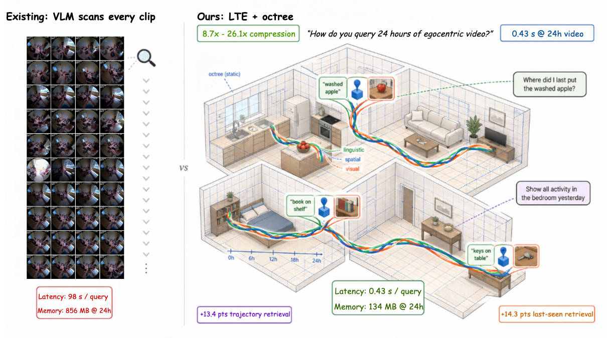
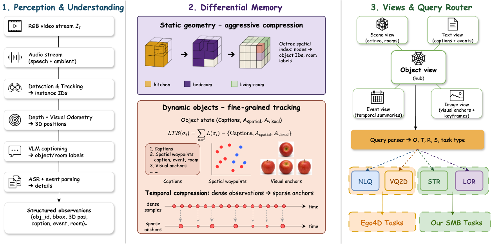

<h1 align="center">ST-Mem · Linguistic Trajectory Encoding</h1>

<p align="center">
  <strong>Linguistic Trajectory Encoding for Efficient Long-Horizon Spatial Memory in Embodied Agents</strong>
</p>

<p align="center"><strong>Accepted at NeurIPS 2026</strong></p>

<p align="center">
  <a href="https://arxiv.org/abs/2609.04802">Paper</a> &nbsp;·&nbsp;
  <a href="https://sealical.github.io/st-mem/">Project page</a> &nbsp;·&nbsp;
  <a href="https://sealical.github.io/st-mem/benchmark/">SMB benchmark</a> &nbsp;·&nbsp;
  <a href="#code">Code coming soon</a> &nbsp;·&nbsp;
  <a href="#citation">Citation</a>
</p>

**Linguistic Trajectory Encoding (LTE)** builds **object-centric spatiotemporal
memory** for long-horizon embodied agents. It compresses object motion histories
into natural-language descriptions, sparse spatial anchors, and visual evidence—
making **what happened, where, and when** queryable across hours to days.



_From long observations to queryable object histories. Original teaser from the
[paper](https://arxiv.org/abs/2609.04802v1); numbers are paper-reported results.
[View full resolution](assets/st_mem_teaser.png)._

## Highlights

- **Compact memory.** Language, sparse geometry, and visual anchors preserve
  complementary evidence in a per-object trajectory representation.
- **Long-horizon retrieval.** Query object state history and motion in natural
  language, or retrieve an object's last observed occurrence.
- **Spatial Memory Benchmark (SMB).** 600 queries from EgoLife recordings for
  Semantic Trajectory Retrieval (STR) and Long-Horizon Object Retrieval (LOR),
  alongside evaluation on Ego4D NLQ and VQ2D.

[Explore the results →](https://sealical.github.io/st-mem/#results) ·
[Benchmark tasks and protocol →](benchmark/README.md)

## Method

ST-Mem is the LTE-based memory system. Five linked views—Object, Scene, Text,
Event, and Image—connect shared object records to language, spatial, and visual
evidence.



_Full research architecture from the [paper](https://arxiv.org/abs/2609.04802v1),
including components outside the planned core release.
[View full resolution](assets/st_mem_framework.png)._

## Code

**Code coming soon.** This repository hosts the project website, not the
implementation. The planned release focuses on a runnable memory-core demo:
LTE, five linked views, portable storage, query APIs, and offline perception
adapters. Full benchmark reproduction and evaluation/training pipelines are
outside its scope; SMB annotations are not released here.

## Citation

If you build on LTE, ST-Mem, or SMB, please cite our paper.
[Download BibTeX](citation.bib) · [Citation metadata](CITATION.cff)

<details>
<summary>BibTeX · NeurIPS 2026 accepted paper</summary>

```bibtex
@misc{xie2026linguistictrajectory,
  title = {Linguistic Trajectory Encoding for Efficient Long-Horizon Spatial Memory in Embodied Agents},
  author = {Tianyidan Xie and Shenyi Wang and Qiang Tang and Mingjie Wang and Zhicheng Qiu and Xuanfu Li and Zhan Xu and Jian Yang and Lanjun Wang and Zili Yi},
  year = {2026},
  note = {Accepted at NeurIPS 2026},
  eprint = {2609.04802},
  archivePrefix = {arXiv},
  primaryClass = {cs.CV},
  doi = {10.48550/arXiv.2609.04802},
  url = {https://arxiv.org/abs/2609.04802}
}
```

The citation points to the arXiv version; proceedings metadata will be added
when available.

</details>

---

Website code: [MIT](LICENSE) · Original paper figures:
[CC BY 4.0](https://creativecommons.org/licenses/by/4.0/)
([attribution](assets/README.md)).
